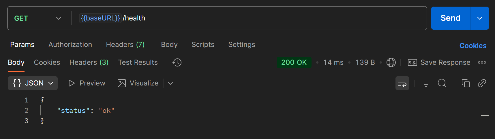

# Отчет по практическому занятию №6
## Основная информация

### Выполнил: Туев Д.

### Группа: ЭФМО-01-25

## Описание окружения

Версия Go: 


Версия PostgreSQL: 


## Запуск
Для запуска приложения необходимо передать при запуске переменную окружения DB_DSN, отвечающую за подключение к БД по структуре:

```bash
$env:DB_DSN="host=127.0.0.1 user=postgres password=postgres dbname=pz6_gorm port=5432 sslmode=disable"
go run ./cmd/server
```


## Выполнение работы
1. Создание БД и настройка проекта

Создана база данных pz6_gorm для работы с ORM GORM.
2. Структура проекта

pz6-gorm
    │   go.mod
    │   go.sum
    │
    ├───about
    ├───cmd
    │   └───server
    │           main.go
    │
    └───internal
        ├───db
        │       postgres.go
        │
        ├───httpapi
        │       handlers.go
        │       router.go
        │
        └───models
                models.go

3. Модели и связи

Реализованы модели со связями:

- User - пользователь (1:N с Note)

- Note - заметка (принадлежит User, M:N с Tag)

- Tag - тег (M:N с Note через note_tags)

Скриншот схемы БД из psql:


4. Автомиграции

Настроено автоматическое создание таблиц через AutoMigrate() на основе Go-структур.
5. REST API

Реализованы HTTP-эндпоинты:

- POST /users - создание пользователя

- POST /notes - создание заметки с тегами

- GET /notes/{id} - получение заметки с автором и тегами

- GET /health - проверка здоровья приложения

## Результаты выполнения

Для осуществления HTTP тестирования проекта в Postman создана собственная [коллекция](https://lively-flare-564043.postman.co/workspace/My-Workspace~fe2081e8-b325-4776-8b48-400d41f5b4bd/collection/42992055-d8072e79-7d39-4313-80bd-da2efe06753a?action=share&creator=42992055), включающая запросы, которые поддерживаются сервисом 

Скриншот проверки здоровья:



Скриншот создания пользователя через Postman:


Скриншот создания заметки с тегами:


Скриншот получения заметки с автором и тегами:


## Ответы по GORM

### 1. Что такое ORM и зачем она нужна, если есть database/sql?

ORM (Object-Relational Mapping) - это технология, которая связывает объекты программы с таблицами базы данных. Нужна потому что:

- Работа с БД через объекты/структуры вместо ручного написания SQL
- Автоматизация CRUD операций (Create, Read, Update, Delete)
- Безопасность от SQL-инъекций
- Кроссплатформенность (легкая смена БД без переписывания кода)
- Ускорение разработки за счет готовых методов

### 2. Как в GORM описать связи 1:N и M:N?

**Связь 1:N (один ко многим):**
```go
type User struct {
    ID    uint
    Name  string
    Posts []Post // User has many Posts
}

type Post struct {
    ID     uint
    Title  string
    UserID uint // Post belongs to User
}
```
Связь M:N (многие ко многим):
```go

type User struct {
    ID    uint
    Name  string
    Roles []Role `gorm:"many2many:user_roles;"`
}

type Role struct {
    ID    uint
    Name  string
    Users []User `gorm:"many2many:user_roles;"`
}
```
### 3. Что делает AutoMigrate? В каких случаях его недостаточно?

AutoMigrate автоматически создает/обновляет таблицы в БД на основе структур Go.

Недостаточно когда нужно:

- Создавать сложные индексы и ограничения

- Выполнять миграции данных (изменение, перенос)

- Создавать кастомные типы полей

- Выполнять откат изменений (rollback)

- Оптимизировать производительность на больших таблицах

### 4. Чем Preload отличается от обычного Find/First?

Preload загружает связанные данные одним запросом (через JOIN), тогда как:

- Find/First загружают только данные основной модели

- Без Preload связанные поля (слайсы структур) остаются пустыми

- Preload избегает проблемы N+1 запроса


### 5. Как в GORM обработать ошибку нарушения уникального индекса?
```go
u := models.User{Name: in.Name, Email: in.Email}
if err := h.db.Create(&u).Error; err != nil {
    writeErr(w, http.StatusConflict, err.Error())
    return
}
```


## Чек-лист выполнения

- Проект запускается командой go run ./cmd/server

- Таблицы создаются автоматически через AutoMigrate

- Связи 1:N и M:N работают корректно

- Preload возвращает связанные данные

- REST-эндпоинты отвечают корректно

- Обработка ошибок реализована